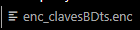

# GENERADOR DE CLAVES CON ENCRIPTADO, DESENCRIPTADO Y LOG EN FORMATO XLS

SE TIENE UN DCUMENTO CON INFORMACIÓN SENCIBLE Y SE REQUIERE ENCRIPTAR


CON INFORMACIÓN
```xml
    <ip_bd1>192.168.1.254 </ip_bd1>
    <user_bd1>user1</user_bd1>
    <pass_bd1>LASDDK#=KI/</pass_bd1>
    <ip_bd2>192.168.1.254 </ip_bd2>
    <user_bd2>user1</user_bd2>
    <ip_bd3>192.168.1.254 </ip_bd3>
    <user_bd3>user1</user_bd3>
    <ip_bd4>192.168.1.254 </ip_bd4>
    <user_bd4>user1</user_bd4>
    <ip_bd5>192.168.1.254 </ip_bd5>
    <user_bd5>user1</user_bd5>
```

PARA ENCRIPTARLO: 

1.- SE GENERAN UN DOCUMENTO CON LLAVES ( KEY-32, IV(NONCE)-12 ) PARA EL ENCRIPTADO


 
CON INFORMACIÓN
```xml
    <key>IY89vWb4k7HXxm8gPpRgVbv96u56qnIv</key>
    <iv>WEYqV5Ef8j5I</iv>
```
Y SE GUARDA EN EL PATH DESTINADO PARA ESTO.

2.- SE ENCRIPTA EL ARCHIVO DE INTERES A ENCRIPTAR Y SE GUARDA EN EL PATH
INDICADO PARA ESTO CON EXTENCIÓN .enc

encriptadorarchivosenrust\creadorclaves\encrptkeys\enc_clavesBDts.enc



Y SE DESENCRIPTA PARA COTEJAR CONGRUENCÍA EN UN ARCHIVO .txt


CON INFORMACIÓN:
```txt
    <ip_bd1>192.168.1.254 </ip_bd1>
    <user_bd1>user1</user_bd1>
    <pass_bd1>LASDDK#=KI/</pass_bd1>
    <ip_bd2>192.168.1.254 </ip_bd2>
    <user_bd2>user1</user_bd2>
    <ip_bd3>192.168.1.254 </ip_bd3>
    <user_bd3>user1</user_bd3>
    <ip_bd4>192.168.1.254 </ip_bd4>
    <user_bd4>user1</user_bd4>
    <ip_bd5>192.168.1.254 </ip_bd5>
    <user_bd5>user1</user_bd5>
```

AL TERMINAR LA COMPROBACIÓN EL RESPONSABLE DEBE DE CARGAR LAS LLAVES AL SISTEMA DE GUARDADO
DE SERVICIOS, EL CUAL GUARDARÁ LAS LLAVES BAJO REGUARDO DE SEGURIDAD Y QA
POR LO QUE ESTA CARPETA DEBE SER DESTRUIDA.

QUEDANDO SOLO LA CARPETA: \encriptadorarchivosenrust\creadorclaves\encrptkeys\
EL CUAL GUARDA EL ARCHIVO .enc 

AL FINAL SE GENERARÁ EL ARCHIVO .xls EL CULA SE DEBERA CARGAR AL SISTEMA (SIGS) Y DESPUES 
DESTRUIR, PARA EVITAR QUE SE COMPROMETA LA SEGURIDAD DE LAS CLAVES.

